# FloodAlert: Local-First Hydrological Simulation & Last-Mile Alerting Pipeline

An end-to-end, zero-cloud-bill hydrological forecasting and disaster alerting pipeline built with the **AWS Open-Source Stack**. Fuses open satellite elevation data, real-time edge rain gauge telemetry, and deep learning surrogate modeling to predict field-level flash floods up to 6 hours before peak inundation with sub-2-second total pipeline latency.

---

## 1. System Architecture

```mermaid
flowchart TD
    subgraph DataIngestion [Phase 2: Ingestion & Telemetry]
        DEM[AWS Open Data Registry<br/>Copernicus 30m DEM COG] -->|Zero-Egress /vsicurl/| Streamer[Terrain & Weather Streamer]
        NOAA[NOAA GFS/HRRR Forecast<br/>Public S3 Rasters] -->|Resampled Grid| Streamer
        Gauge[FreeRTOS Micro-Station<br/>Virtual Tipping-Bucket] -->|MQTT: 1883| Mosquitto[Eclipse Mosquitto]
        Mosquitto -->|Dynamic Bias Correction| Streamer
    end

    subgraph MLSurrogate [Phase 3: Deep Learning Surrogate Engine]
        Streamer -->|3-Channel Tensor<br/>DEM, Slope, Rain| UNet[2D U-Net Hydrological Surrogate<br/>ONNX Runtime CPU < 5ms]
        UNet -->|Water Depth h >= 15cm| Vectorizer[Rasterio & Shapely Vectorizer<br/>Filter artifacts < 900m²]
        Vectorizer -->|EPSG:4326 GeoJSON MultiPolygon| GeoJSON[Predicted Inundation Geometry]
    end

    subgraph SpatialMatch [Phase 4: Geospatial Intersect Engine]
        GeoJSON -->|Index Alert Shape| OpenSearch[(OpenSearch 2.11 OSS<br/>flood_zones Index)]
        OpenSearch -->|geo_shape Intersect Query| Matcher[Cadastral Parcel Matcher<br/>farmer_parcels Index]
        Matcher --> Threatened[Threatened Cadastral Plots<br/>Farmer Names, Coordinates, Phone Nos]
    end

    subgraph PolicyAuth [Phase 5: Deterministic Policy Guardrails]
        Threatened --> Cedar{AWS Cedar Engine<br/>Statutory Policy Check}
        GeoJSON -->|Max Depth & Peak Window| Cedar
        Cedar -->|Decision: ALLOW| VerifiedBatch[Verified Alert Batch]
        Cedar -->|Decision: DENY / DRY_RUN| Halt[Halt & Audit Log]
    end

    subgraph IsolatedDispatch [Phase 6: Hardware-Isolated Fan-Out]
        VerifiedBatch --> MicroVM[Firecracker MicroVM<br/>Boot < 5ms via Linux KVM]
        MicroVM --> Formatter[Regional Dialect Translation<br/>Assamese, Bengali, Hindi, English]
        Formatter --> Gateway[Local Messaging Gateway<br/>SMS & WhatsApp Fan-Out]
    end

    subgraph Observability [Phase 7: Distributed Tracing]
        ADOT[AWS Distro for OpenTelemetry Collector]
        DataIngestion -.->|OTLP Spans| ADOT
        MLSurrogate -.->|OTLP Spans| ADOT
        SpatialMatch -.->|OTLP Spans| ADOT
        PolicyAuth -.->|OTLP Spans| ADOT
        IsolatedDispatch -.->|OTLP Spans| ADOT
    end
```



---

## 2. AWS Open-Source Stack Mapping

| Pipeline Layer | AWS Open-Source Technology | Supporting OSS / Standards | Operational Function |
| :--- | :--- | :--- | :--- |
| **Terrain & Weather Ingestion** | **AWS Registry of Open Data** | GDAL / Rasterio (`/vsicurl/`) | Byte-range retrieval of Copernicus 30m DEM COGs and NOAA precipitation rasters with zero cloud egress costs. |
| **Edge Ground Telemetry** | **FreeRTOS** (POSIX Port) | POSIX Threads, Eclipse Mosquitto | Simulates physical tipping-bucket rain gauges; streams live precipitation rate (mm/hr) telemetry over MQTT. |
| **ML Inundation Surrogate** | *Local Neural Layer* | ONNX Runtime, Shapely, Rasterio | Physics-seeded 2D U-Net forward pass generating continuous water depth matrices ($h$ in meters) in $< 5\text{ ms}$. |
| **Spatial Index & Matching** | **OpenSearch 2.x (OSS)** | GeoJSON Specification | Indexes cadastral farmer parcel coordinates (`geo_point`) and executes spatial `geo_shape` queries against flood polygons. |
| **Disaster Broadcast Auth** | **AWS Cedar Policy Engine** | Cedar CLI 4.13 / Rust Engine | Enforces fine-grained statutory authorization (depth $\ge 15\text{ cm}$, peak $\le 6\text{ h}$, affected plots $> 0$, mode $\ne$ `DRY_RUN`). |
| **Worker Isolation & Fan-Out**| **Firecracker MicroVMs** | Linux KVM (`/dev/kvm`), Minimal Kernel | Spawns hardware-isolated Linux microVMs in $< 5\text{ ms}$ to format dialect emergency messages and dispatch to messaging gateways. |
| **Distributed Observability** | **AWS Distro for OpenTelemetry (ADOT)** | OpenTelemetry Python SDK, OTLP | Collects distributed trace spans across all stages to enforce the sub-10-second end-to-end SLA. |

---

## 3. Directory Structure

```text
flood-pipeline/
├── docker-compose.yml              # Local container orchestrator (OpenSearch, ADOT, Mosquitto)
├── main.py                         # End-to-end orchestrated pipeline entrypoint
├── configs/
│   ├── otel-config.yaml            # ADOT collector OTLP receiver & debug exporter config
│   └── mosquitto.conf              # Mosquitto MQTT broker configuration
├── contracts/
│   └── mock_flood_zone.geojson     # Verified baseline GeoJSON polygon (Warangal basin)
├── sensor/
│   ├── Makefile                    # FreeRTOS POSIX compilation file
│   ├── main_posix.c                # FreeRTOS tipping-bucket simulator publishing to MQTT
│   └── receiver.py                 # Python MQTT telemetry bridge & cache
├── ml_surrogate/
│   ├── requirements.txt            # ML dependencies (onnxruntime, rasterio, shapely)
│   ├── unet.py                     # 2D U-Net architecture specification
│   ├── export_onnx.py              # Physics-informed depression-accumulation weight seeding
│   ├── terrain_stream.py           # Zero-egress GDAL /vsicurl/ DEM and weather stream engine
│   ├── models/
│   │   └── flood_unet.onnx         # Optimized ONNX model binary
│   └── inference.py                # Sub-5ms ONNX Runtime inference & vectorizer
├── opensearch/
│   ├── schemas/
│   │   ├── farmer_parcels.json     # Index schema with geo_point mappings
│   │   └── flood_zones.json        # Index schema with geo_shape mappings
│   ├── sample_parcels.json         # Seed cadastral farmer parcels (Warangal test basin)
│   └── client.py                   # Spatial index and geo_shape query handler
├── policies/
│   ├── alert_policy.cedar          # Cedar authorization policy rules
│   ├── entities.json               # Cedar entity definitions
│   ├── context.json                # Runtime evaluation parameter template
│   └── evaluator.py                # Python wrapper for AWS Cedar CLI
├── microvm/
│   ├── launch_worker.sh            # Firecracker UNIX socket configuration & boot script
│   ├── vmlinux                     # AWS uncompressed Linux kernel binary (>20 MB)
│   └── rootfs.ext4                 # Alpine ext4 root filesystem image (>160 MB)
├── dispatch/
│   └── dispatcher.py               # Multilingual dialect formatter & mock gateway emulator
├── observability/
│   └── tracer.py                   # OpenTelemetry SDK and OTLP gRPC/HTTP exporter setup
└── tests/                          # Complete automated test suite
    ├── test_phase2_telemetry.py    # Tests GDAL DEM streaming and MQTT telemetry
    ├── test_phase3_ml_engine.py    # Tests ONNX inference latency & artifact filtering
    ├── test_phase5_cedar.py        # Tests statutory permit/forbid boundary checks
    ├── test_phase6_dispatch.py     # Tests microVM worker lifecycle and SMS/WhatsApp fan-out
    └── test_phase7_tracing.py      # Tests ADOT trace span emission and SLA limits
```

---

## 4. Prerequisites

* **Docker & Docker Compose**: v2.20+ (with Docker Desktop on Windows or Linux daemon).
* **Python**: 3.10 to 3.13 (installed on host).
* **WSL2 / Linux**: With nested hardware virtualization enabled (`/dev/kvm`) for Firecracker microVMs and GCC for FreeRTOS POSIX compilation.
* **AWS Cedar CLI**: `v4.13.0` (included in `bin/` or installed to system PATH).

---

## 5. Quickstart Guide

### Step 1: Start Infrastructure Services
Boot OpenSearch, Eclipse Mosquitto, and the ADOT Collector:
```bash
cd flood-pipeline
docker compose up -d
```
Verify cluster health:
```bash
curl -s http://localhost:9200/_cluster/health
```

### Step 2: Install Python Dependencies
```bash
pip install -r ml_surrogate/requirements.txt
```

### Step 3: Compile and Run FreeRTOS Sensor (Optional / WSL2)
Inside WSL2 Ubuntu:
```bash
cd sensor
make
./rain_gauge_posix 12
```

### Step 4: Run the Automated Test Suite
Execute all 21 unit and integration tests covering Phases 2 through 7:
```bash
python -m unittest discover tests
```

### Step 5: Execute the End-to-End Pipeline
Run the full hydrological alerting loop:
```bash
python main.py
```

---

## 6. Performance Profile & Verified Benchmarks

Live execution latency measured on developer hardware:

| Pipeline Stage | Technology / Component | Latency | Statutory SLA |
| :--- | :--- | :--- | :--- |
| **Raster Ingestion & Telemetry** | GDAL `/vsicurl/` + FreeRTOS MQTT | ~1020 ms | $< 2000\text{ ms}$ |
| **Neural Inundation Inference** | ONNX Runtime CPU (`flood_unet.onnx`) | **`2.91 ms`** | $< 50\text{ ms}$ |
| **Vector Geometry Extraction** | Rasterio + Shapely (pruning $< 900\text{ m}^2$) | **`5.22 ms`** | $< 200\text{ ms}$ |
| **Spatial Matching** | OpenSearch OSS 2.11 (`geo_shape` query) | **`304.98 ms`** | $< 1000\text{ ms}$ |
| **Cedar Policy Authorization** | AWS Cedar Policy CLI | **`29.81 ms`** | $< 100\text{ ms}$ |
| **MicroVM Fan-Out Dispatch** | Firecracker MicroVM + Mock Gateway | **`20.50 ms`** | $< 500\text{ ms}$ |
| **Total End-to-End Runtime** | **Full Pipeline Loop** | **`~1.44 s`** | **`< 10.0 s`** |

*All trace spans and execution metrics are streamed over OTLP gRPC to the ADOT Collector and verifiable via `docker logs flood-adot`.*
